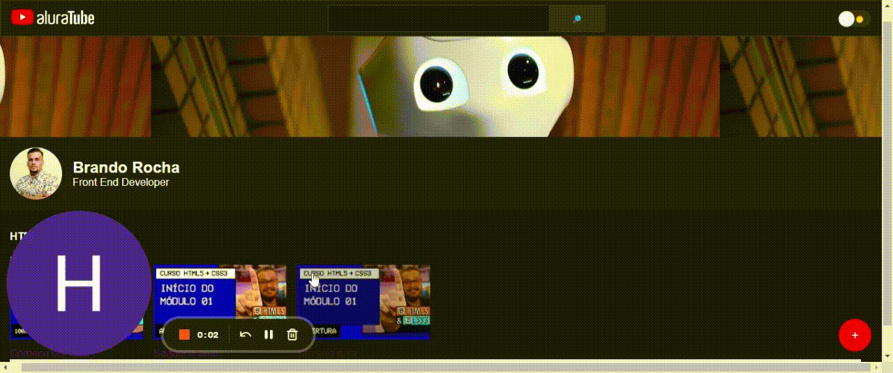

 

>

Project made with ReactJS and Next.

Using UseState and Hooks to make a library of videos for study focusing in goals areas.

---------------------------------------------------------------------------------------

Languages used:

-JavaScript;

-ReactJS;

-NextJS;

---------------------------------------------------------------------------------------

Prospost of Project:

-Training skills and knowledge in the React area with Nest performance distributed in a solid and fast project.